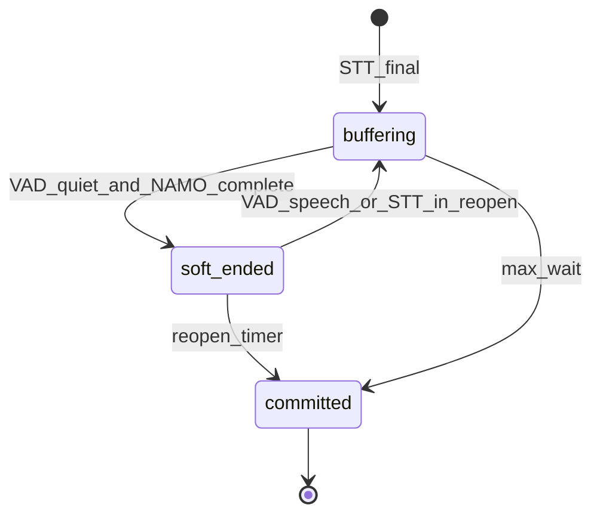

# VoIP turn detection (Namo + TEN VAD)

## `VOIP_STT_MESSAGE_HANDLING`

| Value | STT finals | Turn commit |
|-------|------------|-------------|
| **EOU** (recommended) | Buffered in `botMsgs` | End-of-utterance gate + TEN VAD only (`commitNamoFlush`); no VoIP worker `setSttSilenceDuration` |
| **PSST** / **JOIN** / **CONCAT** | Buffered | With `VOIP_STT_TURN_HANDLER=EOU`, **PSST** handling is normalized to **EOU** on connector validate |
| **ORIGINAL** | Immediate emit | End-of-utterance gate not used |
| **SPLIT** | Immediate per sentence | End-of-utterance gate not used |

Objective tests with `VOIP_OTS_LATENCY_PROFILE` default handling to **EOU** when unset (`applyOtsLatencyProfile`).

### OTS latency profile defaults (when unset on chatbot)

| Cap | OTS default | Connector default |
|-----|-------------|-------------------|
| `VOIP_NAMO_EMIT_STABLE_MS` | 280 | 600 |
| `VOIP_NAMO_REOPEN_MS` | 500 | 800 |
| `VOIP_NAMO_MAX_WAIT_MS` | 4000 | 8000 |
| `VOIP_NAMO_MIN_WAIT_MS` | 0 | 250 |
| `VOIP_NAMO_QUESTION_FLUSH_MS` | 0 (off) | 2000 |
| `VOIP_NAMO_MAX_WAIT_VAD_EXTENSION_MS` | 0 (off) | 1500 |
| `VOIP_STT_AZURE_SEGMENTATION_SILENCE_TIMEOUT_MS` | 400 | 500 |

### Tuning caps (advanced)

- `VOIP_NAMO_REOPEN_FAST_MS` / `VOIP_NAMO_REOPEN_FAST_EOU` — shorter reopen when EOU is very high.
- `VOIP_NAMO_QUESTION_MIN_CHARS` — minimum last-segment length for question heuristic (denylist for fragments like “How can I?”).
- `VOIP_NAMO_MIN_SEGMENT_CHARS` — defer max-wait clock on very short first finals until another final or VAD speech end.
- `VOIP_NAMO_MAX_WAIT_VAD_EXTENSION_MS` — one-time extension before `max_wait` flush **only when TEN VAD reports speech active** (connector default 1500; OTS profile sets 0).
- `VOIP_NAMO_JOINED_QUESTION_FLUSH_*` — when Namo joined-EOU is low but the last STT chunk is a high-confidence `?` prompt (≤2 chunks), commit the **joined** text without splitting (ATT Spanish + intent menu); cohesion runs immediately on the second final (no extra emit-stable wait).
- **Max-wait clock** — `pendingStartedAt` anchors to `speechEndSec` from the latest STT final when available; a later final **re-anchors** so multi-chunk IVR menus measure `max_wait` from the last speech end, not the first chunk arrival.
- **Reply budget** — when `VOIP_REPLY_BUDGET_MS` > 0, `max_wait` is capped so flush occurs by `speechEnd + (budget − coach − wire)` (floor 800ms), preserving coach/wire time for the 5s wire SLO (`namo_max_wait_deadline_cap` in logs).

### TEN VAD (inbound lane)

- Model: sherpa-packaged `assets/models/ten-vad.int8.onnx` (see `assets/models/TEN-VAD.md`). `Validate()` parses ONNX metadata (`ten_vad_model_resolved`) and fails fast if the file is wrong or missing.
- Invalid cache under `~/.cache/botium/ten-vad` is removed and re-downloaded once.

### Half-duplex outbound gate (agent playout)

When `VOIP_HALF_DUPLEX_ENABLE` is true (default), `UserSays` wire audio waits on [`outbound-gate.js`](src/inbound/outbound-gate.js):

- **Soft wait** — reply-budget wire reserve (~800ms when `VOIP_REPLY_BUDGET_MS` is set).
- **Hard wait** — up to `VOIP_OUTBOUND_GATE_MAX_WAIT_MS` (default 5000ms) while **STT partials** (`VOIP_OUTBOUND_GATE_STT_PARTIAL_MS`, default 1500ms lookback) or **TEN VAD `speechActive`** block.
- Agent audio is not forced on wire at the soft cap if the IVR is still active; `outbound_gate_forced` logs a last-resort `max_wait` at the hard cap.

- **buffering** — append STT finals; never `queueBotSays`.
- **soft_ended** — ready to emit; reopenable (`VOIP_NAMO_REOPEN_MS`).
- **committed** — only path that flushes to the coach (`namo_flush`, `namoGate.committed`).

VAD **speech start** (or another STT final) during `soft_ended` reopens the turn (card readback join). VAD **speech end** does not commit alone; `max_wait` is the hard fallback.

## Gates

- **Cohesion** — Namo on joined vs last segment.
- **Emit stability** — `VOIP_NAMO_EMIT_STABLE_MS` before soft-end.
- **Short-segment merge** — `VOIP_NAMO_VAD_SHORT_SEGMENT_MERGE_MS`.
- **DTMF echo** — digit-only STT after agent DTMF suppressed.

## PSST fallback

If Namo model init or inference fails, the connector disables Namo and uses the legacy PSST silence timer (`VOIP_NAMO_FALLBACK_HANDLING`).

## Manual verification (OTS logs)

1. Set handling **EOU** (or rely on OTS defaults).
2. Expect per bot turn: `stt_final` → `namo_candidate_received` / `namo_decision` → `namo_flush`.
3. No VoIP worker `setSttSilenceDuration` while handling is EOU; `voip.psstTimerArmed` from the gate should include `strategy: EOU`.
4. **ORIGINAL** chatbots should still emit on each final without `namo_decision`.
5. Force Namo failure (invalid model path): `namo_model_error` then PSST fallback timers / flush.

### ATT / ST9 validation targets (after tuning)

- `namo_flush` by `reason`: majority `model_complete`; `max_wait` share ideally below ~25%.
- p50 `bufferedMs` on `model_complete` toward ~400–600ms (OTS emit-stable + min-wait).
- No `question_heuristic` flushes on sub-20-character fragments unless explicitly enabled (`VOIP_NAMO_QUESTION_FLUSH_MS` > 0).
- Compound IVR menus (two STT finals): expect `namo_joined_question_stt_flush` or fast `model_complete`, not `max_wait` at 6.5s.
- `namo_max_wait_extended` only when VAD is active (if extension cap > 0).
